# Home Call Guard Mobile App — Release Candidate 1 (RC1) Handover

**Branch:** `sandbox/mobile-app-v1` (worktree `/Users/ad/call-ai-sandbox-mobile-app-v1`), branched from `main` at `8b12816`
**HEAD at this handover:** `08b048c`
**Status:** Feature-complete for the approved V1 Launch Feature Matrix. **Not yet store-submittable** — see Remaining Blockers.
**Date:** 2026-07-30

---

## 1. Commits since Phase 2 began

10 commits, `8b12816..08b048c`, all on the sandbox branch, `main` untouched throughout.

| Commit | Summary |
|---|---|
| `ba4c930` | Backend groundwork: bearer-token auth middleware (`requireAuthApi`), `/api/v1` router, migration 021, `database/calls.js` extraction |
| `301bff5` | Fix: mobile-created Supabase sessions never bootstrapped a household — added `POST /api/v1/me/bootstrap` |
| `28bd3a9` | Extracted shared checkout-session logic; added mobile subscribe endpoint |
| `8048b30` | Dedicated activation-instructions endpoint — resolves the Twilio-number-exposure architectural conflict |
| `b26088e` | Mobile Manage Membership endpoint; recorded the pre-existing web activation gap in `KNOWN_ISSUES.md` |
| `a8136ff` | Complete React Native/Expo V1 screen set (largest commit — the full app) |
| `29d19a2` | CORS headers on the mobile API (dev-workflow enabler, safe under bearer auth) |
| `7cbe83f` | Visual QA infrastructure (web-preview + Playwright substitute for a simulator) + 2 real bugs it found |
| `1cb46c6` | Added missing tab bar and device-picker icons (`@expo/vector-icons`) |
| `08b048c` | Fixed not-entitled handling on Contacts, Activity, Membership, Account |

Full messages: `git log --reverse 8b12816..08b048c` in the sandbox worktree.

**Stat:** 70 files changed, 12,500 insertions, 247 deletions.

---

## 2. Completed features (V1 Must-Have, per `LAUNCH_FEATURE_MATRIX.md`)

| Matrix item | Screens | Status |
|---|---|---|
| Register / confirm email / login / forgot / reset password | A1–A7 | ✅ Built, visually verified |
| Protection Status home screen | C1 | ✅ Built, both entitled and not-entitled states verified |
| Membership subscribe (Stripe Checkout handoff) | B2 | ✅ Built, verified (Checkout session creation only — see Blockers re: full payment completion untested) |
| Device/provider picker + activation instructions | B3, B4 | ✅ Built, verified end-to-end including the server-generated forwarding code |
| Activation verification (server-checked) | B5 | ✅ Built, "not yet verified" state verified — see Blockers re: the success path |
| Manual add / edit / delete trusted contact | C2, C3 | ✅ Built, verified against real contact data |
| Activity list (no drill-down) | C4 | ✅ Built, verified against real historical call data |
| Manage Membership (Billing Portal handoff) | D1 | ✅ Built, verified |
| Support (contact + FAQ) | D3 | ✅ Built — shipped with FAQ content too, not just contact details (a small overshoot of the Must-Have bar, reusing existing copy at no extra cost) |
| Legal links | D4 | ✅ Built, links to real terms/privacy pages |
| Account hub | C6 | ✅ Built, verified |
| Offline / session-expiry handling | E3, E4 | ✅ Home screen has an offline banner fallback; not-entitled (402) handling fixed across all four screens that needed it |
| B4 speakerphone-conflict copy | B4 | ✅ Present, verified in screenshot |

All 20 screens (plus the B3 landline-provider sub-state) were visually verified — see §5.

---

## 3. Deferred features (per approved matrix — not built, by design)

**Should Have (fast-follow):** native contact picker (B6–B8), call detail drill-down (C5), push notifications + preferences (E2/D2), Sign in with Apple/Google, FAQ-from-real-tickets refresh, deeper activation troubleshooting content.

**Future:** family/shared visibility, CallKit-style native call handling (explicitly rejected for V1 per `APP_DECISION_007`), Android `CallScreeningService` blocklist layer, TTS/audio narration for activation instructions, shareable assisted-setup link, activity pagination, dedicated read endpoints separate from the aggregate dashboard call.

None of these were started. No partial/half-built scaffolding exists for any of them.

---

## 4. Known issues

### Mobile-specific (found this phase)

1. **Migration 021 has not been applied to the real Supabase database** — see §6, this is a release blocker, not just a known issue.
2. Screens that call `fetchDashboard()` and previously mishandled a 402 were fixed (Contacts, Activity, Membership, Account) — no longer an issue as of `08b048c`.
3. Tab bar / device-picker icons were missing — fixed as of `1cb46c6`.
4. No React Native-side automated test suite exists (no Jest/RNTL). The 328 automated tests are all backend (Node). `tsc --noEmit` is currently the only automated client-side signal. Manual testing (§9) is load-bearing until this exists.
5. Placeholder bundle identifier (`co.uk.homecallguard.app`) has not been confirmed available/reserved with Apple or Google.
6. App icon, splash screen, and adaptive icon assets are still the **default Expo template placeholder** (a generic blue arrow) — not real Home Call Guard branding. Confirmed by inspection, not just by filename.

### Inherited from the wider project (directly relevant to mobile launch)

From `docs/launch/KNOWN_ISSUES.md` (main repo):
- **UK Twilio number purchase requires a registered Twilio Address** (Severity 1 for real provisioning) — blocks real call screening for any *new* customer until a registered office address is confirmed and a Twilio Address object is created. This directly affects whether B3/B4 can do anything meaningful for a brand-new signup today.
- Migration 016's fix was independently verified, then found silently reverted on the live database, with no infrastructure cause yet identified — per that document, no previously-verified database change in this project should be assumed to still be in place without re-checking. This is directly relevant precedent for why migration 021's application must be independently re-confirmed, not just re-attempted once.
- Web dashboard has no self-service activation instructions (the gap the mobile app's new endpoint solves for itself only) — recorded, not fixed, per explicit scope decision this phase.
- Terms & Conditions need solicitor sign-off; registered office address is still a placeholder in `terms.html`.

---

## 5. Screenshots of every screen

Captured via `expo start --web` + Playwright at a 390×844 viewport (see §8 for why — no iOS Simulator/Android Emulator exists in this environment). Screens requiring an active entitlement (B4, B5, B9, and the protected states of C1/C2/C4/D1) were captured using a **temporary** complimentary entitlement grant on the existing QA sandbox household only, following the same pattern already present in that household's own history. It was revoked immediately after capture and independently re-confirmed reverted (`getActiveEntitlement` → `null`, `subscriptions`/`households` rows unchanged). No production household, subscription, or billing record was touched. Full detail in §10.

All images: `docs/screenshots/mobile-rc1/`.

### Auth (A1–A7)

| Screen | Image |
|---|---|
| A1 Splash (redirects to A2 for a signed-out visitor — has no persistent UI of its own) | 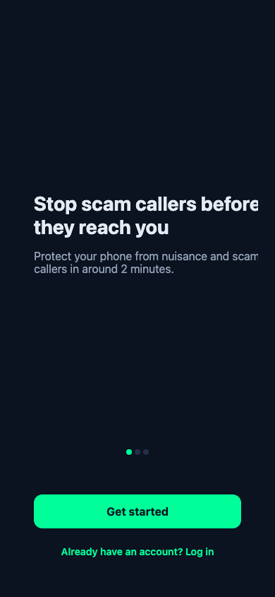 |
| A2 Welcome / value carousel |  |
| A3 Register | 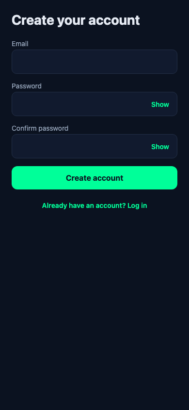 |
| A4 Confirm email (shown here without the `email` param — real users always arrive via A3's `router.push`, which sets it) |  |
| A5 Login | 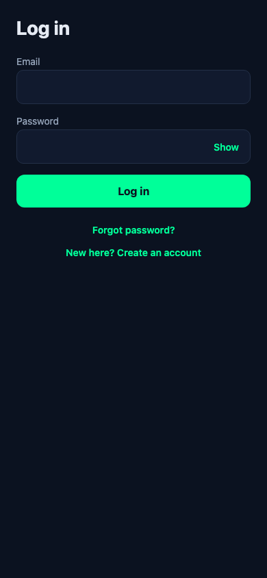 |
| A6 Forgot password | 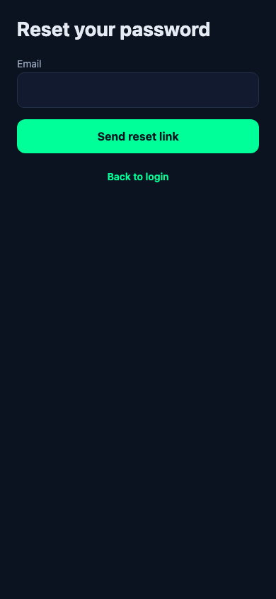 |
| A7 Reset password (shown here in its "invalid/missing link" fallback state — real users only reach the working state via a genuine deep link) | 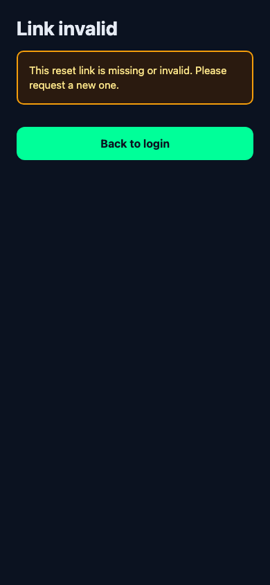 |

### Setup (B1–B5, B9)

| Screen | Image |
|---|---|
| B1 Setup welcome | 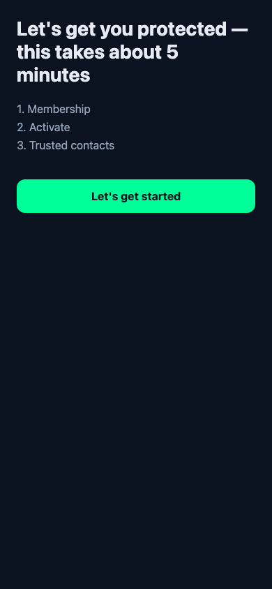 |
| B2 Subscribe | 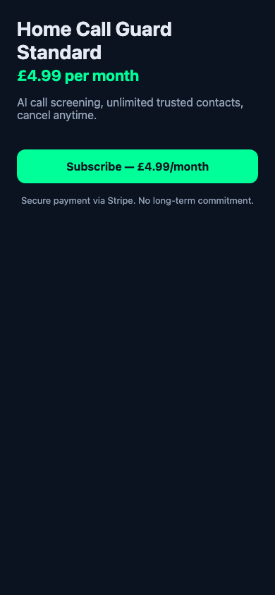 |
| B3 Device picker | 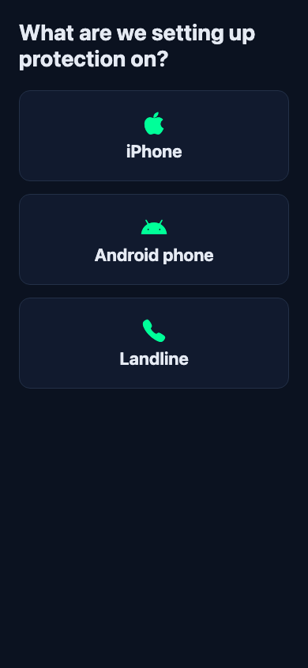 |
| B3 Landline provider sub-list | 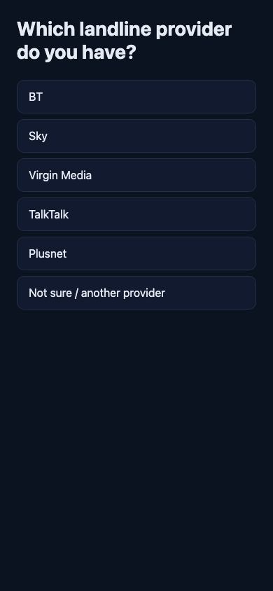 |
| B4 Activate (real server-generated code, real household) | 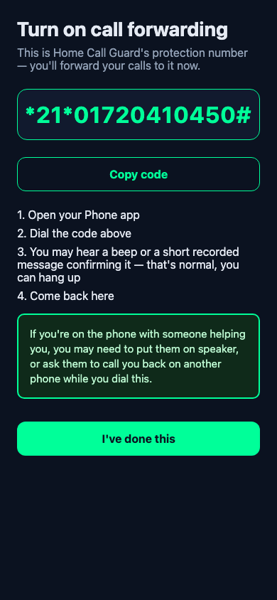 |
| B5 Verify — not-yet-verified state | 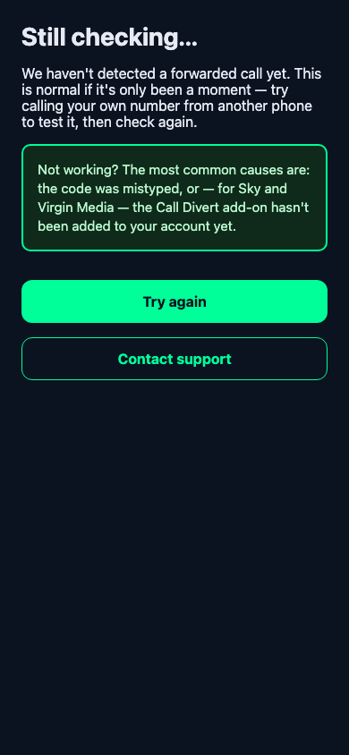 |
| B9 Complete | 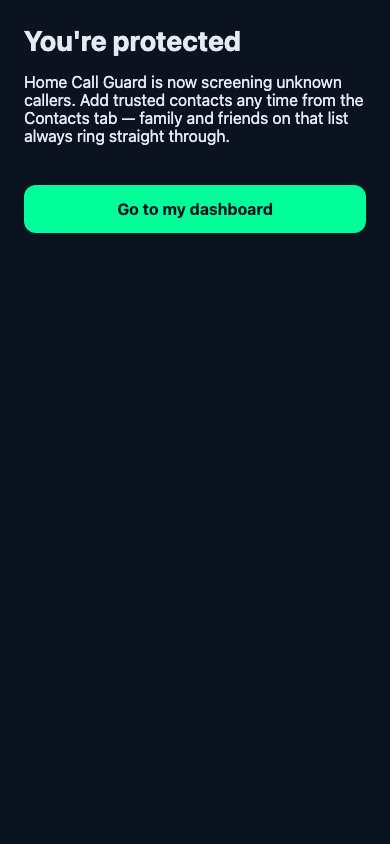 |

### Daily use (C1–C4, C6) + Account (D1, D3, D4)

| Screen | Image |
|---|---|
| C1 Home — not entitled | 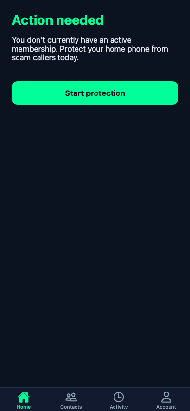 |
| C1 Home — entitled, setup incomplete | 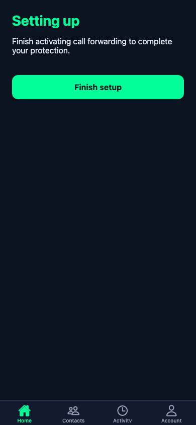 |
| C2 Contacts — not entitled | 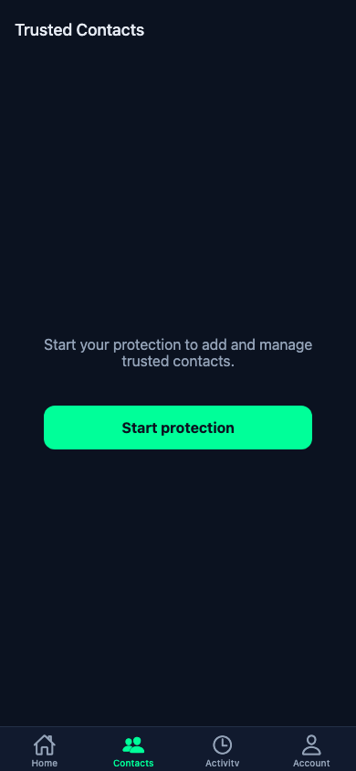 |
| C2 Contacts — entitled, real data | 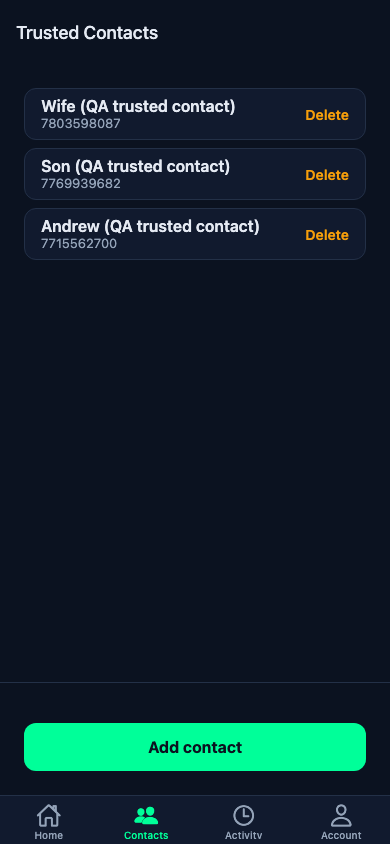 |
| C3 Add contact | 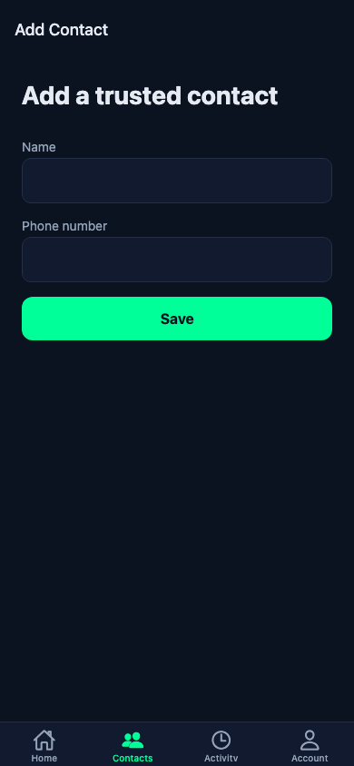 |
| C4 Activity — not entitled | 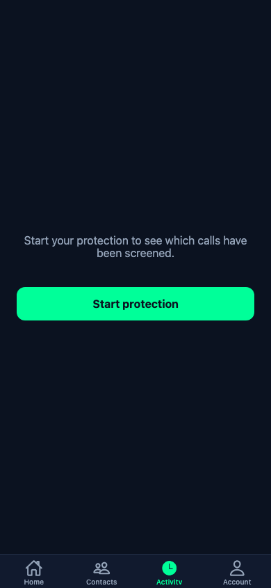 |
| C4 Activity — entitled, real call history | 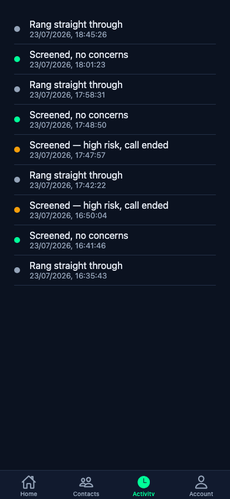 |
| C6 Account | 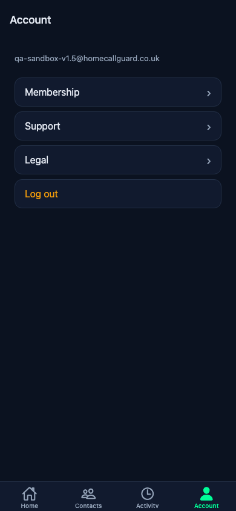 |
| D1 Membership — not entitled | 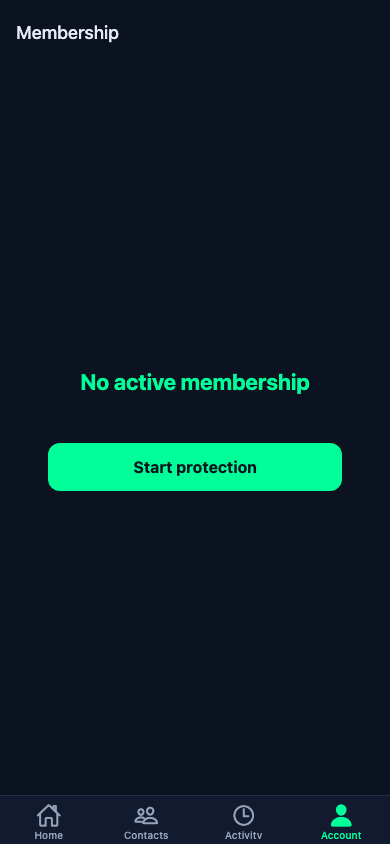 |
| D1 Membership — entitled ("Cancelling at period end" — real historical state) | 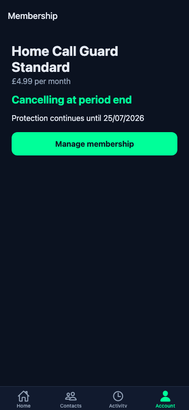 |
| D3 Support | 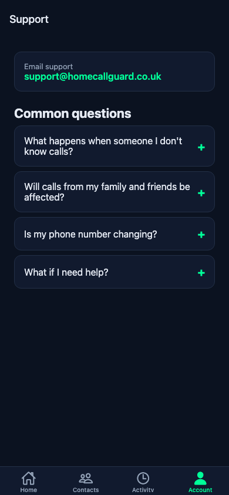 |
| D4 Legal | 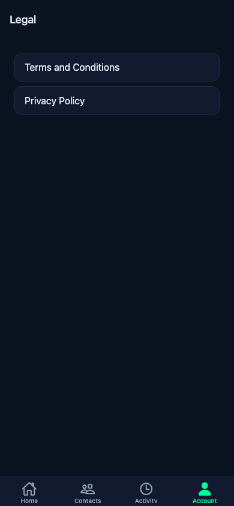 |

No visual defects found in this pass beyond the two already fixed in `7cbe83f` (SecureStore web crash, welcome-screen centering) and the not-entitled/icon issues fixed in `1cb46c6`/`08b048c`.

---

## 6. API endpoints added

All in `routes/mobileApi.js`, mounted under `/api/v1`. Router-scoped `express.json()` only (not global — `routes/billing.js`'s webhook route needs the raw body for Stripe signature verification).

| Method | Path | Auth | Purpose |
|---|---|---|---|
| POST | `/api/v1/me/bootstrap` | `verifyBearerToken` (not `requireAuthApi` — chicken-and-egg, no household exists yet) | Creates household/role for a mobile-originated Supabase session on first login |
| GET | `/api/v1/me/dashboard` | `requireAuthApi` + `requireEntitlement` | Aggregate data for Home/Contacts/Activity/Account — never includes a bare `twilioNumber` field |
| POST | `/api/v1/billing/create-checkout-session` | `requireAuthApi` only | Stripe Checkout session, deep-link success/cancel URLs |
| POST | `/api/v1/billing/manage-membership` | `requireAuthApi` | Stripe Billing Portal session, deep-link return URL |
| GET | `/api/v1/activation/instructions` | `requireAuthApi` + `requireEntitlement` | Generates the complete forwarding code server-side; the one deliberate, narrow exception to "never expose the Twilio number" |
| POST | `/api/v1/activation/verify` | `requireAuthApi` | Checks for a recent inbound call within the verification window; calls `markActivationVerified` (depends on migration 021 — see §6/§10) |
| POST | `/api/v1/contacts` | `requireAuthApi` + `requireEntitlement` | Add trusted contact |
| PUT | `/api/v1/contacts/:id` | `requireAuthApi` + `requireEntitlement` | Edit trusted contact |
| DELETE | `/api/v1/contacts/:id` | `requireAuthApi` + `requireEntitlement` | Remove trusted contact |

No existing web route or endpoint was modified. `GET /dashboard-data` (web) and `GET /api/v1/me/dashboard` (mobile) both remain free of any bare Twilio number field, by design.

---

## 7. Database changes

**One migration added this phase:** `supabase/migrations/021_household_activation_verified.sql`
- Adds `households.activation_verified_at timestamptz`
- Adds `mark_household_activation_verified(p_household_id uuid) returns timestamptz` — idempotent, `SECURITY DEFINER`, `service_role`-only execute grant
- Validated against PGlite (`tests/migrations.pglite.test.mjs`): sets on first call, idempotent on second, raises for a nonexistent household, `authenticated` role denied execution

**🔴 Confirmed during this handover: migration 021 has NOT been applied to the real Supabase database.** Directly verified two ways:
1. `households.activation_verified_at` — querying it by column name returns `column households.activation_verified_at does not exist`.
2. `supabaseAdmin.rpc('mark_household_activation_verified', ...)` — returns `PGRST202: Could not find the function public.mark_household_activation_verified(p_household_id) in the schema cache`.

**Practical impact today:**
- `GET /api/v1/me/dashboard` does not crash (it reads `req.household.activation_verified_at` as a plain JS property access, which is just `undefined` on a row missing the column — not a SQL error), but `activationVerifiedAt` will never read as anything other than `null`. Home (C1) will show "Setting up" forever, even after a real customer genuinely completes activation.
- `POST /api/v1/activation/verify` **will throw a runtime error (500)** the first time it ever detects a qualifying call and tries to call the missing RPC. This did not surface in this handover's testing only because the QA household had no real recent call to trigger that code path — it is a live, real defect, not a hypothetical one.

**This is the top release blocker** — see §10.

No other schema changes were made or are pending from this phase.

---

## 8. Installation instructions

Prerequisites: Node.js (matches root project — confirmed working with Node 25.x), npm, an Expo account is *not* required for local development (only for EAS Build later).

```bash
git worktree add -b sandbox/mobile-app-v1 /path/to/checkout main   # or: cd into the existing sandbox worktree
cd mobile
npm install --legacy-peer-deps   # --legacy-peer-deps needed: expo-router pulls in a React-19/vaul/@radix-ui peer conflict, benign
cp .env.example .env
# Fill in .env:
#   EXPO_PUBLIC_SUPABASE_URL=<same Supabase project the web app uses>
#   EXPO_PUBLIC_SUPABASE_ANON_KEY=<the anon/publishable key, not service_role>
#   EXPO_PUBLIC_API_BASE_URL=https://www.homecallguard.co.uk   # or a local backend for dev, see below
npx expo start
```

To develop against a local backend instead of production (recommended for anyone testing entitlement edge cases):
```bash
# from the repo root
PORT=3099 node server.js &
# then in mobile/.env:
EXPO_PUBLIC_API_BASE_URL=http://localhost:3099
```
The mobile API's CORS headers (added `29d19a2`) make this work transparently in a browser-based preview too.

Typecheck: `npx tsc --noEmit` from `mobile/` — currently clean.

---

## 9. Simulator instructions

**No iOS Simulator or Android Emulator exists in the environment this phase was built in** (confirmed: no `Xcode.app`, `xcode-select -p` shows only Command Line Tools, no `simctl`, no `adb`/Android SDK/emulator anywhere). All visual verification in this handover used `expo start --web` + Playwright screenshots as the best available substitute — **this is not a substitute for running the actual native app** and should not be treated as equivalent sign-off.

For whoever has a real Mac with Xcode / Android Studio installed:

```bash
cd mobile
npx expo start
# then press:
#   i   — opens iOS Simulator (requires Xcode installed)
#   a   — opens Android Emulator (requires Android Studio + an AVD configured)
# or scan the printed QR code with the Expo Go app on a real device
```

All packages used (`expo-router`, `expo-secure-store`, `expo-web-browser`, `expo-status-bar`, `expo-clipboard`, `@expo/vector-icons`) are Expo Go-compatible — no custom native module requires a custom dev client build for this to work. A full native run (real device behavior for SecureStore, deep links, in-app browser handoff) has **not** been performed by this phase of work and is the single highest-value manual verification step remaining.

---

## 10. TestFlight / Google Play preparation checklist

Not started items are marked ❌; none of this was in scope for Phase 2 and none of it has been done.

**Both platforms**
- ❌ Real app icon, splash screen, and adaptive icon assets — currently the **default Expo template placeholder** (confirmed by direct inspection, not just filename)
- ❌ `eas.json` does not exist — EAS Build has never been configured for this project
- ❌ Confirm `co.uk.homecallguard.app` is actually available and reserve it with both Apple and Google (currently just a config-file placeholder, never checked against either store)
- ❌ Privacy policy / terms URLs reviewed for store submission (existing pages need the solicitor sign-off already flagged in `KNOWN_ISSUES.md`, plus registered-office-address placeholder resolved)
- ❌ Data-safety / privacy "nutrition label" content prepared — this app touches phone numbers and call metadata, which both stores scrutinize; needs a considered answer, not a default one
- ❌ Support URL and marketing URL
- ❌ Real device screenshots at each store's required sizes (the ones in this handover are web-preview substitutes at a fixed 390×844 viewport, not valid for store listing submission)

**Apple / TestFlight specific**
- ❌ Apple Developer Program enrollment
- ❌ App Store Connect record created
- ❌ Review the app's positioning against Apple's call-blocking/CallKit review guidelines — this app does **not** implement a CallKit Call Directory extension (deliberately, per `APP_DECISION_007`); worth a deliberate pre-submission check that "call screening" copy in the app doesn't imply native call-blocking capability the app doesn't have, since this is a plausible rejection/clarification-request vector
- ❌ TestFlight internal testing group

**Google Play specific**
- ❌ Google Play Console developer account
- ❌ Content rating questionnaire
- ❌ Target API level / Play policy compliance check (Android 14+ requirements)
- ❌ Closed testing track set up

---

## 11. Recommended manual test plan

Given there is no RN-side automated test suite, this is the primary release gate. Should be run on a real iOS device/simulator and a real Android device/emulator, not just the web-preview substitute.

**Auth**
1. Register with a new email → confirm-email screen shows the real address → check inbox → tap confirmation link → app opens directly, session active
2. Log in with correct / incorrect credentials
3. Forgot password → real email → tap link → reset → auto-signed-in afterward
4. Force-quit and reopen the app while logged in — session persists (SecureStore round-trip on a real device, not the web fallback)

**Setup**
5. New, never-subscribed account → B1 shows the welcome copy (not skipped)
6. Subscribe via real Stripe Checkout (test mode) → return to app → B1 now skips straight to B3 for the same account
7. Device picker: all three device types + all six landline providers reachable and route correctly
8. B4: confirm the displayed code matches `*21*<realnumber>#` for mobile, the Virgin extra-zero/double-hash variant, and the Sky/Virgin £2.50/150-call caveat text
9. B4 "Copy code" actually copies a dialable string
10. B5: dial the real code on a real phone against a real forwarding-capable number, confirm B5 detects it and advances **— this exercises the exact code path currently blocked by the missing migration 021; expect this to fail with a 500 until that's applied**
11. B9 → Go to dashboard lands on C1 in the "Protected" state, not "Setting up"

**Daily use**
12. Add / edit / delete a contact; confirm duplicate-number rejection behaves the same as the web app
13. Activity list reflects a real recent call correctly categorized (trusted / screened-clean / screened-high-risk)
14. Cancel a subscription via the Billing Portal handoff (D1) → returns to app via deep link → membership status updates
15. Log out and back in — confirm no stale data from the previous account appears anywhere

**Cross-cutting**
16. Airplane mode mid-session on Home — offline banner appears, last-known status still shown, not a blank/error screen
17. Every screen: VoiceOver (iOS) / TalkBack (Android) pass over primary controls — not verified at all this phase
18. Deep links (`homecallguard://reset-password`, checkout/portal return URLs) actually open the app on a real device, not just in-app browser context

---

## 12. Remaining blockers before internal beta

Ordered by severity:

1. **Migration 021 is not applied to the real database.** Must be applied and independently re-verified (both the column and the RPC, live, not just re-running the deploy) before any real activation-verification testing — otherwise B5's success path will 500 for the first real tester who completes it. Given the wider project's own precedent of a previously-verified migration silently reverting, verify after applying, don't just trust the deploy step.
2. **No real simulator/device run has happened yet.** Everything in this handover was verified via a web-preview substitute. SecureStore, deep links, the in-app browser Stripe handoff, and native gesture/accessibility behavior are all unverified on a real iOS/Android runtime.
3. **Twilio UK number purchase is blocked on a registered Address** (inherited, Severity 1 in the wider project's own known-issues doc) — without this, B3/B4 have nothing real to activate for a genuinely new signup, only for households that already have a number (like the QA fixture).
4. **Store-readiness is at zero**: no EAS config, no developer accounts, placeholder icons/bundle ID, no real data-safety/privacy answers prepared. None of this blocks an *internal* beta via direct device installs, but all of it blocks TestFlight/Play distribution.
5. **No RN-side automated test coverage.** The manual test plan in §11 is currently the only safety net for the client codebase.
6. Minor, non-blocking: A4's confirm-email copy and A7's reset-password screen were only exercised via direct URL navigation in this pass (missing their real params by construction) — worth one real end-to-end pass through the actual register/reset flows rather than relying on the code-review confirmation given in §5.

---

## 13. QA methodology note — temporary entitlement grant

To capture the entitled-state screenshots in §5, a temporary `complimentary` entitlement was inserted directly on the existing QA sandbox household (`6555f0f4-2978-478f-8bdc-68ec3f2c74b2`) — the same household and pattern already present in its own history (`"Stage 2/3/4 testing only"` entries). Sequence, for the record:

1. Inserted: `entitlement_type: complimentary`, `status: active`, 1-hour window, `source: admin_manual`, `notes` explicitly marking it as this RC1 QA pass.
2. Captured all entitled-state screenshots.
3. Updated the same row to `status: revoked`, `ends_at` set to the actual revocation time.
4. Independently re-confirmed via `getActiveEntitlement()` (the same function the real API uses) that it returns `null` again.
5. Independently re-confirmed `subscriptions` (3 rows, all `canceled`, unchanged) and `households` (unchanged) for that household.

No production household, subscription, entitlement, or billing record was created, modified, or deleted. Only the one QA sandbox household's `entitlements` table gained one row, now revoked.
