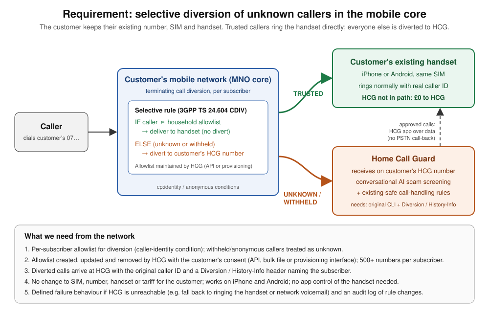

# Carrier-facing architecture: selective diversion of unknown callers

**Purpose:** a one-page explanation of HCG's requirement for carrier discussions. It shows no HCG internals.
**Diagram:** [`carrier-architecture.svg`](carrier-architecture.svg)



## The requirement in one sentence

When a call arrives for an HCG customer's **existing mobile number**, the network delivers it to the customer's handset as normal if the caller is on the customer's trusted list. Otherwise, including withheld numbers, the network diverts it to the customer's HCG number for AI scam screening.

## Text version

```
Caller ──► Customer's MNO core
             │  per-subscriber diversion rule (3GPP TS 24.604 CDIV, cp:identity / anonymous)
             │
             ├─ caller ∈ HCG-maintained allowlist ──► customer's existing handset rings
             │                                        (same SIM/number; HCG not in path)
             │
             └─ unknown or withheld ───────────────► customer's HCG number
                                                      (original CLI + Diversion/History-Info)
                                                      → AI screening + safe handling rules
                                                      → approved calls delivered via HCG app over data
```

## What we are asking a network for

1. **Per-subscriber selective diversion** based on caller identity. Withheld or anonymous callers are treated as unknown.
2. **An allowlist managed by HCG**, with the customer's consent, through an API, bulk file or provisioning interface. It needs to hold 500+ numbers per subscriber.
3. **Signalling preserved on diverted calls:** the original caller ID plus a Diversion / History-Info header naming the subscriber.
4. **No change for the customer:** same SIM, number, handset and tariff, on both iPhone and Android.
5. **Defined failure behaviour** if HCG is unreachable (ring the handset, or network voicemail), plus an audit log of rule changes.

## Why the network, not the handset

- **iPhone:** iOS offers no API to redirect cellular calls. The only handset-side route depends on undocumented Apple behaviour (see REPORT.md §2–3).
- **Android:** a handset route exists, but it depends on an app running on the phone and on the network turning a decline into busy forwarding.
- **What a network rule adds:** it covers both platforms, handles withheld callers, and keeps trusted calls off HCG's telephony bill.
- **Standards support:** TS 24.604 §4.9.1.3 supports the conditions; GSMA IR.92 §2.3.8 leaves deployment to the operator.
- **Market:** no UK consumer product offering this was found in earlier research.

## Status

This is a discussion aid only. No carrier has been contacted on the basis of this document.
